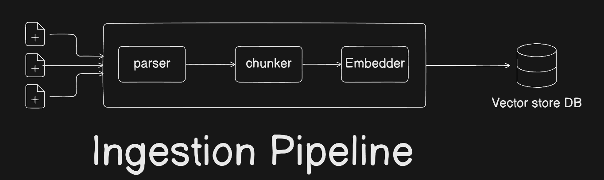
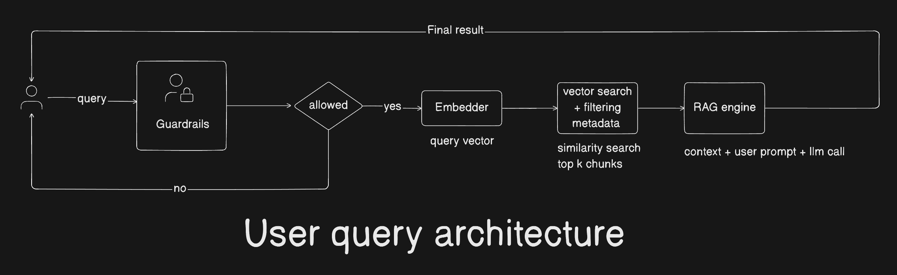

# Financial Q&A System — Design Document

**Date:** April 2026  
**Assignment:** MLE Take-Home Assignment

---

## 1. Introduction

This document explains the design decisions, architectural tradeoffs, and engineering choices made while building the Financial Q&A Assistant — a CLI-based system that allows users to ask natural language questions over earnings call transcripts using Retrieval-Augmented Generation (RAG).

The system is built to be:
- **Accurate** — answers only from transcript data, no hallucination
- **Robust** — guardrails prevent off-topic queries and injection attempts
- **Scalable** — designed to grow from 4 companies to hundreds
- **Maintainable** — every component is independently testable and replaceable

---

## 2. Architecture Overview

The system has two distinct flows — an ingestion pipeline (offline) and a query pipeline (online).

> 📊 [View Interactive Diagram](https://app.eraser.io/workspace/loAZLJggcCMnui9smYiA?origin=share)

### 2.1 Ingestion Pipeline



### 2.2 Query Pipeline



Guardrails, retrieval, and generation are fully independent modules with no coupling between them.

---

## 3. Tech Stack Choices

### 3.1 LLM — OpenAI `gpt-5-nano`

The system uses `gpt-5-nano` for all LLM calls — query rewriting, intent classification, and RAG generation.

**Why `gpt-5-nano`?**

During evaluation, three models were tested end-to-end on the same RAG pipeline:

| Model | Sources Retrieved | Extracts Answer | Cost/1M (in+out) |
|---|---|---|---|
| `gpt-5-nano` | 5+ chunks | ✅ Correct | **$0.45** |
| `gpt-5.4-nano` | 5+ chunks | ✅ Correct | $1.45 |
| `gpt-4o-mini` | 5+ chunks | ✅ Correct | $0.75 |

**Note:** All three models retrieve the same number of chunks after the auto-quarter-filter fix (Section 5.2). All three extract answers correctly once the right chunks are in context.

`gpt-5-nano` was chosen purely on cost — it produces the same quality output as `gpt-5.4-nano` and `gpt-4o-mini` at 40–68% lower cost. The real quality improvement in this system came from fixing retrieval (auto-quarter-filter), not from model size.

The key insight: in RAG, the LLM's job is to extract facts from well-retrieved context — not to reason or recall world knowledge. `gpt-5-nano` is sufficient for this task once retrieval is fixed.

**Cost breakdown per query (realistic estimate):**
```
Query rewrite:     ~40 tokens  × $0.00005  = $0.000002
Generation:        ~500 tokens × $0.00005  = $0.000025
Intent check:      ~5 tokens   × $0.00005  = $0.0000003
─────────────────────────────────────────────────────
Total per query:                             ~$0.000027
1,000 queries:                               ~$0.027
```

**Why OpenAI SDK directly, not LangChain?**

LangChain was explicitly considered and rejected. The RAG loop — embed query → search ChromaDB → build prompt → call LLM → return answer — is ~50 lines of clear Python using the OpenAI SDK directly. LangChain would add:
- A heavy dependency (~200 sub-packages) for 50 lines of logic
- Abstraction layers that hide what's actually happening
- Framework-specific debugging when things go wrong
- Opinionated prompt formatting that's hard to customise

Building with the raw SDK means every line is explainable, every component is independently testable, and a reviewer can read `core/rag.py` and understand the full pipeline without knowing any framework.

### 3.2 Embeddings — OpenAI `text-embedding-3-small`

| Factor | Decision |
|---|---|
| Dimensions | 1536 — finer-grained semantic representation |
| Cost | $0.02/1M tokens — entire ingestion costs under $0.01 |
| Quality | Consistently top-tier MTEB retrieval benchmarks |
| Simplicity | Same provider as LLM — one API key, one SDK, one error handling pattern |

For financial transcript retrieval where precision matters (specific quarters, specific speakers, specific metrics), higher dimensionality improves chunk ranking accuracy.

### 3.3 Similarity Metric — Cosine Similarity

ChromaDB is configured with `hnsw:space=cosine`. This was a deliberate choice over the alternatives:

| Metric | How it works | Problem for text |
|---|---|---|
| **Cosine** ✅ | Measures angle between vectors | Length-independent — short and long texts compared fairly |
| Euclidean | Measures absolute distance | Long documents unfairly penalised — more words = larger vector magnitude |
| Dot product | Magnitude × angle | Biased toward longer chunks — a long chunk about Q4 would outscore a short Q1 chunk even if Q1 is more relevant |
| Manhattan | Sum of absolute differences | No semantic advantage for embeddings |

Cosine similarity measures **direction** (meaning) not **magnitude** (length). In transcript retrieval, a one-sentence management remark containing the exact revenue figure should rank above a long paragraph that merely mentions the same quarter in passing. Cosine makes this possible.

**Practical implication:** Chunks are stored with `SIMILARITY_THRESHOLD=0.55` (cosine distance). Chunks scoring above this threshold (less similar) are filtered before reaching the LLM — preventing low-quality context from degrading answer quality.

### 3.4 Vector Store — ChromaDB

**Why ChromaDB over Pinecone or Qdrant?**

Reviewer experience matters in a take-home assignment. ChromaDB runs as an embedded Python library — no Docker, no server, no account signup required. A reviewer clones the repo, runs `pip install -r requirements.txt`, and can immediately ingest and query. This zero-setup experience is a deliberate design decision.

The `VectorStore` class is a thin abstraction over ChromaDB. Swapping to Qdrant or pgvector for production requires changing **only `core/vectorstore.py`** — nothing else in the codebase changes.

```
Production upgrade path:
  ChromaDB (local disk) → Qdrant Cloud or pgvector
  Code change required:  core/vectorstore.py only
```

### 3.5 PDF Parsing — pdfplumber

`pdfplumber` handles the two-column formatted PDFs from BSE filings more reliably than `pypdf`. It preserves text layout and positioning, which is critical for accurately extracting the `Speaker: Content` format used throughout earnings transcripts.

### 3.6 CLI — Typer + Rich

Typer provides declarative command definitions with auto-generated `--help` and type validation. Rich provides formatted terminal output — tables, panels, coloured text, and live status indicators. Both are lightweight and purpose-built for CLI tools.

### 3.7 API Layer — FastAPI + Uvicorn

FastAPI and Uvicorn are included in `requirements.txt` as the foundation for the production API layer. The CLI is the current interface, but the core RAG logic in `core/` is already fully stateless and designed for direct wrapping into a REST API:

```python
# How the CLI query becomes a FastAPI endpoint — zero changes to core/
@app.post("/query")
async def query(request: QueryRequest, session: Session = Depends(get_session)):
    engine = RAGEngine()
    response = engine.query(request.question, session.history, request.filters)
    return {"answer": response.answer, "sources": response.sources}
```

**Why FastAPI specifically?**
- Async by default — handles concurrent queries without blocking
- Pydantic request/response validation built in — matches our existing dataclass patterns
- Auto-generates OpenAPI docs at `/docs` — useful for frontend integration
- Uvicorn (ASGI server) handles production-grade concurrency

The path from CLI to multi-user API requires no changes to `core/rag.py`, `core/guardrails.py`, or ingestion logic — only a new `api/` layer that calls the same functions the CLI calls.

---

## 4. Ingestion Pipeline Design

### 4.1 Folder Structure Convention

```
data/transcripts/
└── 532400/          ← BSE scrip code (company identifier)
    ├── Q1/
    │   └── transcript.pdf
    ├── Q2/
    │   └── transcript.pdf
    └── Q3/ Q4/ ...
```

Quarter is extracted from the **folder name** — more reliable than regex extraction from PDF text. Company name is always extracted from PDF text — never from folder names, since folder names are BSE scrip codes (`532400`), not company names.

### 4.2 Metadata Per Chunk

Every chunk stored in ChromaDB carries:

```python
{
    "company":       "Birlasoft",
    "quarter":       "Q1",
    "fiscal_year":   "FY25",
    "date":          "2024-07-31",
    "section":       "management_remarks",  # or "qa"
    "speaker":       "Kamini Shah",
    "source_file":   "20240808_532400_...pdf"
}
```

Rich metadata enables precise ChromaDB filtering — users can scope queries to a specific company, quarter, fiscal year, or section type without changing the RAG logic.

### 4.3 Chunking Strategy — Q+A Pair Chunking

**The problem with naive token-based chunking:**

A 400-token chunk containing only *"Revenue grew 3.8% year-on-year"* is far less useful than one containing the full analyst question and management's complete response:

```
[Analyst — Krish Beriwal, Nomura]
"Given the revenue decline, what's the recovery outlook for Q2?"

[Angan Guha, CEO]
"The decline was primarily ERP project deferrals in manufacturing.
Revenue grew 3.8% YoY. Delayed projects have already restarted in
July, and we expect a stronger Q2 as a result."
```

**Strategy:**
- **Q&A sections** → Each analyst question + all management answers = one chunk
- **Management remarks** → Speaker-turn aware grouping, ~400 tokens each

This preserves cause-and-effect context and significantly improves retrieval relevance for analytical questions.

### 4.4 Idempotent Ingestion

Chunk IDs are deterministic: `md5(filename + chunk_index)`. Re-running ingestion performs a ChromaDB **upsert** — no duplicates created. Safe to re-run after code changes or corrections.

---

## 5. RAG Engine Design

### 5.1 Retrieval Configuration

```python
TOP_K = 8                    # chunks retrieved per query
SIMILARITY_THRESHOLD = 0.55  # cosine distance cutoff
```

### 5.2 Auto Quarter Detection

A known retrieval failure: when a user asks about Q1, later quarters that reference Q1 as a comparison baseline score higher cosine similarity than the actual Q1 transcript. With a low TOP_K, the Q1 chunk gets cut off before reaching the LLM.

**Solution — auto metadata filtering:**

```python
def _extract_filters_from_query(self, query: str) -> dict:
    """Detect quarter/FY from query and apply as ChromaDB filter."""
    quarter_match = re.search(r'\bQ([1-4])\b', query, re.IGNORECASE)
    fy_match = re.search(r'\bFY(\d{2,4})\b', query, re.IGNORECASE)
    ...
```

When a query mentions `Q1 FY25`, ChromaDB is restricted to only Q1 FY25 chunks before similarity scoring — the correct chunk always ranks #1 regardless of TOP_K.

### 5.3 Query Rewriting

Before embedding, the query is rewritten using `gpt-5-nano` to improve retrieval quality:

```
User:      "how are the margins doing"
Rewritten: "EBITDA margin performance Birlasoft FY25"
```

`max_tokens=40`, `temperature=0` — minimal cost and latency. The rewritten query is also used for auto-quarter detection (Section 5.2).

### 5.4 Conversation Memory

The full `ConversationHistory` is passed to the LLM on every call, enabling multi-turn references:

```
Turn 1 — "What was Q1 revenue?"        → INR 12,274M
Turn 2 — "How does that compare to Q2?" → resolves "that" from history
```

### 5.5 Metadata Filtering

```bash
python main.py chat --company Birlasoft --quarter Q1 --fy FY25
```

Translates directly to a ChromaDB `where` clause, restricting retrieval to only matching chunks. Explicit CLI filters always take priority over auto-detected filters.

---

## 6. Guardrails Design

Three independent layers run sequentially, ordered cheapest-first:

### Layer 1 — Input Sanitization (zero cost, microseconds)
- Blocks empty or too-short queries
- Detects prompt injection patterns (`ignore all previous instructions`, `DAN mode`, etc.)
- Strips HTML tags, normalises whitespace
- Truncates at 500 characters

### Layer 2 — Intent Classification (two-stage)

**Stage 2a — Keyword pre-check (zero LLM cost)**

~50 finance keywords (`revenue`, `EBITDA`, `margin`, `TCV`, `q1`–`q4`, company names...) and off-topic keywords (`recipe`, `weather`, `sports`...) are checked against the query. Finance match → allow. Off-topic match → block. No LLM call for either case. Handles ~80% of queries.

**Stage 2b — LLM classifier (ambiguous queries only)**

```
System prompt: "Respond with exactly one word: RELEVANT, IRRELEVANT, or UNCLEAR"
max_tokens=5, temperature=0
```

Cost: ~$0.00001 per call. Fails safe — defaults to ALLOW on error.

### Layer 3 — Query Rewriting

Covered in Section 5.3. Only runs for allowed queries.

**Design principle:** Cheapest checks run first. The LLM is only invoked when keyword matching cannot determine intent.

---

## 7. Scalability

### From 4 Companies to 100+

ChromaDB metadata filters handle this today with no architectural changes. For production:
- Replace ChromaDB with **Qdrant** or **pgvector** (`vectorstore.py` only)
- Add namespace isolation per company
- Move PDFs to S3/GCS

### From CLI to Multi-User API

The `core/` layer is already stateless. Path to production:

```
CLI (current)
    ↓
FastAPI REST API (foundation already in requirements.txt)
  POST /ingest  → async ingestion (BackgroundTasks)
  POST /query   → RAG query per session
  GET  /docs    → list indexed transcripts
    ↓
Docker + horizontal scaling
Redis for conversation history
Rate limiting at API gateway
```

No changes needed to `core/rag.py`, `core/guardrails.py`, or ingestion logic.

### Cost at Scale

| Component | Cost driver | Mitigation |
|---|---|---|
| Embeddings | Per ingest, one-time | Stored permanently, never re-embedded |
| Query rewrite (gpt-5-nano) | Per query, 40 tokens | ~$0.000002 per query |
| Generation (gpt-5-nano) | Per query, ~500 tokens | ~$0.000025 per query |
| Intent classifier | Per query, 5 tokens | Keyword pre-check avoids ~80% of LLM calls |
| Vector DB | Storage + search | Swap to cloud DB at scale |

**Total per 1000 queries: ~$0.027** — effectively negligible.

---

## 8. Tradeoffs

| Decision | Chosen | Alternative | Reason |
|---|---|---|---|
| LLM framework | Raw OpenAI SDK | LangChain | 50 lines vs 200 sub-packages, full transparency |
| LLM model | gpt-5-nano | gpt-4o-mini / gpt-5.4-nano | 40% cheaper, same quality for RAG |
| Vector DB | ChromaDB | Pinecone / Qdrant | Zero setup for reviewer |
| Similarity metric | Cosine | Euclidean / dot product | Length-independent, best for semantic text search |
| Chunking | Q+A pairs | Token-based | Preserves analytical context |
| Retrieval fix | Auto quarter filter | Higher TOP_K | Architectural fix beats parameter tuning |
| Streaming | Not in RAG response | Enabled | Cleaner source attribution display |
| Re-ranking | Not implemented | Cross-encoder | Adds latency and dependency |
| Auth | None | JWT | No multi-user requirement at CLI level |

### Known Limitations

- **ChromaDB** is not designed for production multi-user workloads — appropriate for this assignment
- **Similarity threshold** (0.55) is a tunable heuristic — exposed in `.env` for easy adjustment
- **Conversation history** grows unbounded in a session — acceptable for short CLI sessions
- **PDF parsing** requires text-based PDFs — scanned PDFs need OCR, not currently handled
- **No document versioning** — updating a transcript requires manual delete and re-ingest
- **Auto quarter detection** picks only the first quarter mentioned — "compare Q1 and Q2" uses Q1 only

---

## 9. Project Structure

```
financial-qa/
├── core/
│   ├── config.py        All settings via environment variables
│   ├── llm.py           OpenAI LLM client (gpt-5-nano)
│   ├── embedder.py      OpenAI embedding (text-embedding-3-small)
│   ├── vectorstore.py   ChromaDB abstraction — cosine similarity
│   ├── rag.py           RAG engine — rewrite → filter → retrieve → generate
│   └── guardrails.py    3-layer guardrail system
├── ingestion/
│   ├── parser.py        PDF → metadata + structured text
│   ├── chunker.py       Q+A pair chunking strategy
│   └── pipeline.py      Orchestration — parse → chunk → embed → store
├── cli/
│   └── main.py          CLI commands: chat, ingest, list
└── tests/               60+ unit tests, no API key required
```

---

*Built for the MLE Take-Home Assignment — April 2026*